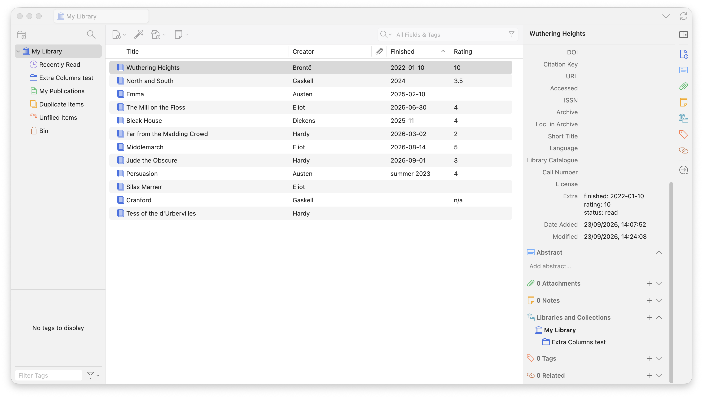

# Extra Columns

[](https://www.zotero.org)
[](LICENSE)
[](https://github.com/mrpsharp/zotero-extra-columns/actions/workflows/ci.yml)

A [Zotero](https://www.zotero.org) plugin that shows values stored in an item's
**Extra** field as columns in the item list.

Many people keep custom data in Extra as `key: value` lines — a date you
finished reading something, a rating, a project name. Zotero stores it happily
but never shows it. Extra Columns makes those values visible and sortable
alongside title, creator and date.



## Installing

1. Download the latest `extra-columns.xpi` from the
   [Releases page](https://github.com/mrpsharp/zotero-extra-columns/releases).
   In most browsers you will need to right-click the link and choose
   _Save Link As…_, so that the file is saved rather than opened.
2. In Zotero, go to **Tools → Plugins**.
3. Click the gear icon at the top right and choose **Install Plugin From File…**.
4. Select the downloaded `.xpi` and restart Zotero if prompted.

Zotero updates the plugin automatically when a new release is published.

## Using it

1. Open **Edit → Settings → Extra Columns** (**Zotero → Settings** on macOS).
2. Click **Add column** and fill in:
   - **Column header** — what the column is called in the item list. Leave it
     empty to use the Extra key itself.
   - **Extra key** — the key to look for in Extra, for example `finished`.
   - **Type** — `Text`, `Date` or `Number`. This only affects sorting.
3. Close settings, then right-click the item list's column headers (or click the
   column picker at the right-hand end of them) and switch on your new column.

Changes take effect immediately; there is no need to restart Zotero. Removing a
definition removes its column.

## The Extra format

Extra Columns reads Extra one line at a time:

```
finished: 2026-08-14
rating: 4
reading group: Tuesday evenings
```

- One `key: value` pair per line. Everything before the first colon is the key.
- Keys are matched without regard to case or surrounding whitespace, and may
  contain spaces.
- Where the same key appears more than once, the first occurrence wins.
- Lines that are not `key: value`, and keys with an empty value, are ignored.
- Items without the key show an empty cell.

### Sorting

Sorting follows the type you chose for the column:

| Type   | Sorts                         | Notes                                                                                                     |
| ------ | ----------------------------- | --------------------------------------------------------------------------------------------------------- |
| Text   | Alphabetically, ignoring case |                                                                                                           |
| Date   | Chronologically               | Accepts `YYYY-MM-DD`, `YYYY-MM` and `YYYY`. A partial date sorts before the more precise dates within it. |
| Number | Numerically                   | Accepts a leading sign, decimals and exponent notation.                                                   |

Values that cannot be read as a date or a number sort after those that can, and
empty cells sort last of all.

Because Zotero has no comparison hook for plugin columns, date and number
columns sort on a hidden key rather than on the text you see. One side effect:
while a date or number column is the one you are sorting by, Zotero's
type-to-jump matches that hidden key rather than the displayed value. Text
columns are unaffected.

## A caveat about keys Zotero uses itself

Zotero does not treat Extra as inert. Some keys it claims for itself, in two
different ways:

- **CSL variables** — `original-date`, `number-of-pages`, `status` and the
  rest. When Zotero builds a citation it hands these to your citation style,
  whatever the item type, so the value can appear in citations and
  bibliographies.
- **Zotero's own field and creator names** — `call number`, `cast member` and
  so on. Zotero matches these when it reads Extra and may take the value out of
  Extra altogether, storing it as that field instead.

You can still make a column for such a key, and it will show what is in Extra.
The settings pane simply tells you which of the two applies, so the choice is a
deliberate one. Citation warnings are highlighted, because those are the ones
with consequences outside Zotero.

A key can be both. `status` is a CSL variable _and_ a Zotero field on patent
and standard items, so it gets the citation warning, the more serious of the
two.

If you only want somewhere private to keep a note, pick a key Zotero does not
claim — `reading status` rather than `status`, for instance. Both lists are
read from the running Zotero's own schema, so they stay accurate as Zotero
changes.

## Roadmap

- **v0.1.0** — settings pane and read-only columns. _(current)_
- **v0.2.0** — an optional item pane section with an edit box per configured
  key, writing changes back into Extra without disturbing the other lines.

## Development

Requires Node.js 20 or later and a local Zotero installation.

```bash
npm install
cp .env.example .env    # then point it at your Zotero binary and dev profile
npm start               # launches Zotero with the plugin, and reloads on save
npm run build           # produces .scaffold/build/extra-columns.xpi
npm run test            # unit tests, in Node
npm run test:zotero     # runs the smoke test inside Zotero
npm run lint:fix
```

The version lives in `package.json` alone. The build writes it into
`addon/manifest.json`, and the release workflow uses it for the release and the
update manifest.

Commit messages follow [Conventional Commits](https://www.conventionalcommits.org/).

### Releasing

Pushing a `vX.Y.Z` tag builds the `.xpi`, creates a GitHub Release with it
attached, and publishes `update.json` so that installed copies update
themselves.

```bash
npm version minor       # or patch / major; commits and tags
git push --follow-tags
```

## Credits

Built on [windingwind/zotero-plugin-template](https://github.com/windingwind/zotero-plugin-template).

## Licence

[AGPL-3.0-or-later](LICENSE).
